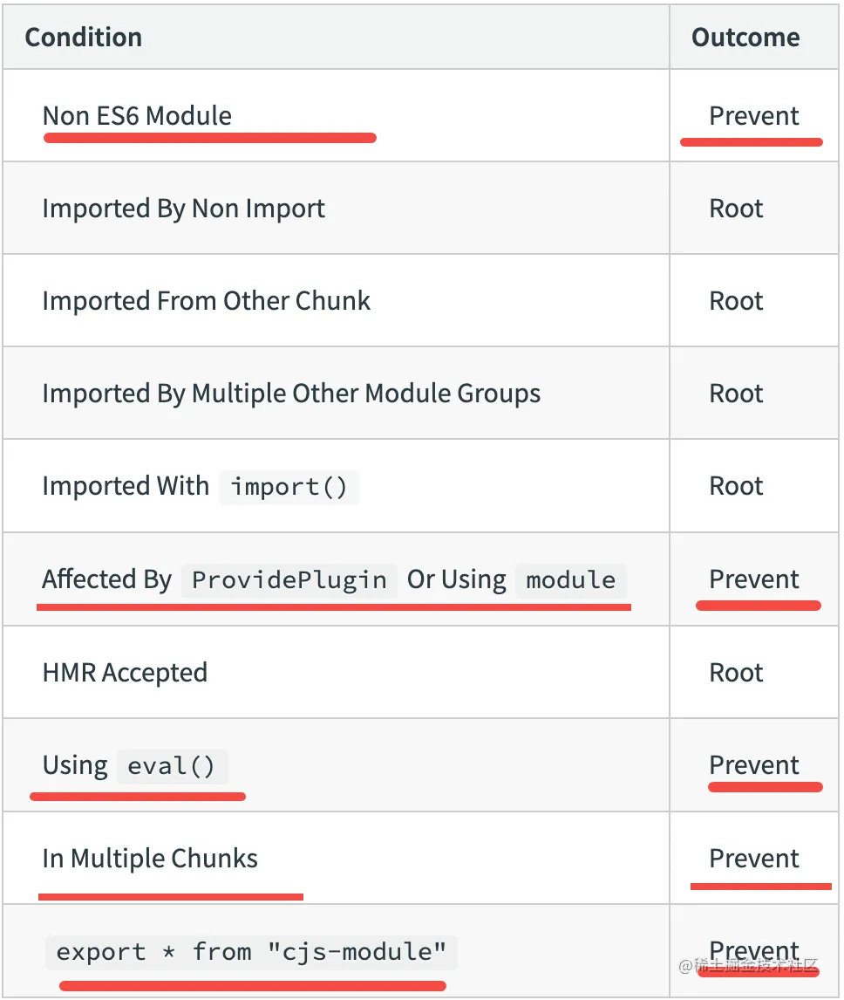
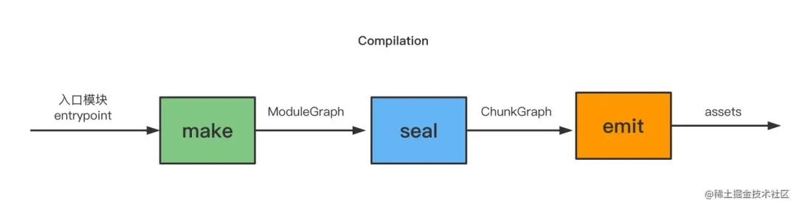

### scope hositing 

1. 作用：
   1. 性能提升
   2. 天然实现了部分模块的 tree shaking
2. 开启方式：
   ```ts
     optimization: {
         concatenateModules: true // => 实际使用 ModuleConcatenationPlugin 插件
      },
   ```
3. 功能
   1. 模块的代码被合并到了一个函数作用域里。
   2. 如有重名，则会带上模块文件名的前缀
   3. 异步引入的模块是会被分到单独的 chunk
4. 不进行 scope hositing 情况：
   1. 被多个 chunk 包含的模块(如果 hositing 会重复)
   2. 有 cjs 代码的模块(不能被分析)
   3. 有 eval 的模块(不能被分析)
   4. 用到了 module 变量的模块
   

### webpack 流程
 
1. make 是从入口模块开启，递归解析依赖，生成模块依赖图 ModuleGraph。
2. seal 阶段是把 module 分到不同的 chunk，也就是分组，生成 ChunkGraph。
3. emit 阶段把每个 chunk 使用模版打印出来，生成代码，也就是 assets。
4. 之后把 assets 写入磁盘就好了。
   
### ModuleConcatenationPlugin 
1. 工作原理
   1. 在 seal 阶段的 optimizeChunkModules 的 hook 生效
   2. 会遍历所有模块，把不适合 scope hositing 的模块过滤掉，同时记录下不合适的原因。
   3. 剩下的有的是入口模块，有的是其他的可以被 scope hositing 的模块，放到 ConcatConfiguration 对象里，它的作用就是记录根模块和子模块
   4. 遍历 ConcatConfiguration 对象来创建一个个新的 ConcatenatedModule 类型的 module ，替换之前的 module。
2. 作用
   1. 代码生成的时候会调用每个 ConcatenatedModule 对象的 codeGeneration 方法：
      1. 遍历模块，根据类型分别打上 concatenated 和 external 的类型标记（单独一个模块，还是合并到一起）（concatenated 通过 AST 查找是否有同名变量）
      2. 拼接代码字符串的时候就会根据不同的类型做不同的处理、使用不同的模版


