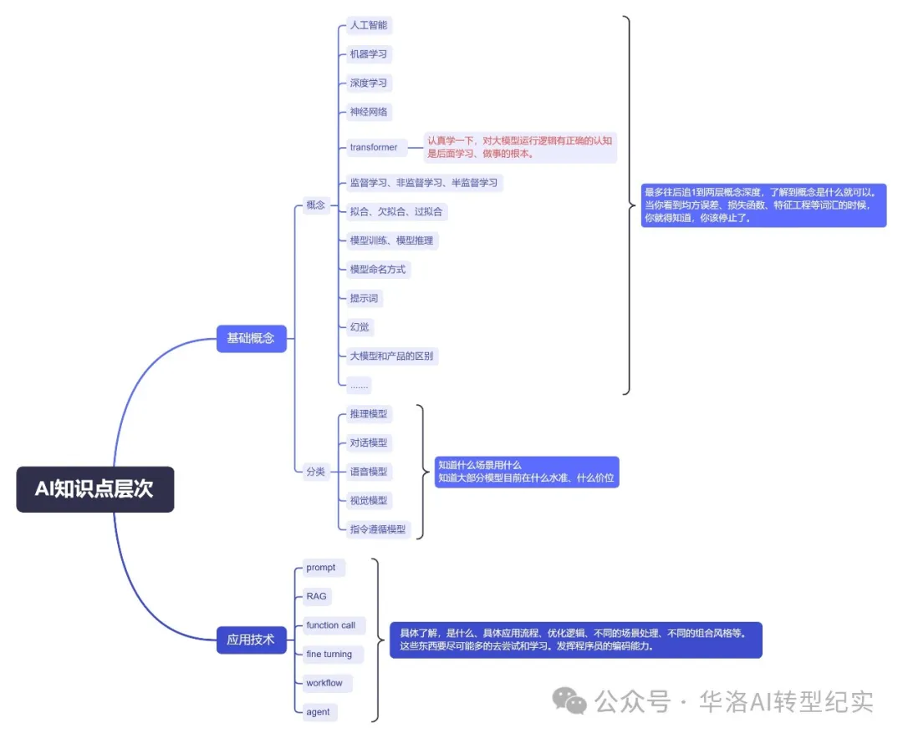

### 如何解决生成式 AI 的几个核心挑战

1. 知识更新滞后性、幻觉问题(RAG)
2. 功能单一性(function calling)
3. 专业领域适应性(微调)

### 机器学习的基本要素

1. 模型
2. 学习准则
3. 优化算法

### 机器学习的几种方式

1. 监督学习
2. 无监督学习
3. 半监督学习
4. 强化学习

### 深度学习中不同神经网络架构的优缺点

1. 前馈神经网络(MLP)
   1. 例如 识别手写数字
   2. 基础结构：输入层、隐层、输出层
2. 卷积神经网络(CNN)
   1. 例如 图像识别
   2. 基础结构：卷积层、池化层、全连接层
      1. 池化层：滑动窗口
3. 循环神经网络(RNN)
   1. 模型开始有记忆力
4. Transformer

### 神经网络的过程

1. 前向传播
2. 反向传播
   1. 可能出现的问题
      1. 梯度消失
      2. 梯度爆炸
   2. 解决办法：归一化

### 模型量化与模型蒸馏的区别

### embedding 与 tokenizer 的区别

1. tokenizer 是将文本转换为 token
2. embedding 是将 token 转换为向量

### 模型的训练与推理过程

### 模型的评估指标

### 模型的部署方式

### 模型的边界约束

1. 理解能力
2. 上下文长度
3. 私域知识储备
   但： 越接近上下文上限，或者代码逻辑越复杂，模型的理解能力就会越差

